# Sign Language Production on How2Sign: A Diagnostic Investigation

**TL;DR.** We investigated why state-of-the-art FID numbers on the How2Sign sentence-to-motion task do not correspond to motion that actually reflects the input sentence. Through a sequence of four experiments — reproducing the paper's main results, retraining with stronger forward-kinematics losses, a noise-vs-sentence ablation on the diffusion model, and a clean encoder-decoder regression baseline — we conclude that the bottleneck is **data, not architecture**. With only ~26K (sentence, motion) pairs and one motion sample per sentence, every model we trained — diffusion or regression, small or large — collapses to a sentence-independent average pose. The clean regression baseline shows this collapse most directly: doubling training data from 13K to 26K makes it *worse*, not better, ruling out architectural artifacts as the cause.

---

## 1. Background — the paper's main experiments

The task is **English text → SMPL-X motion sequence**: take a How2Sign English sentence, output 100 frames of upper-body axis-angle parameters (132 dims/frame: 44 joints × 3) that produce a signing avatar. We evaluate using FID on a Motion-AE latent (`MotionAE_How2Sign3D`), plus joint-region FID/joint-velocity sanity statistics.

### 1.1 Architectures evaluated

We trained three diffusion backbones and two conditioning modes for the paper's main results table (7 cells):

| Backbone | What it does |
|---|---|
| **MDM** | Standard motion-diffusion-model transformer encoder. |
| **kin** | Standard transformer encoder with an added **per-layer learnable scalar bias over temporal relative offsets** (frame ↔ frame). Despite the historical name, this variant does **not** encode any skeleton / kinematic-tree structure — the only difference from MDM is the relative-position bias on the time axis. |
| **ms** | Two-stream temporal pyramid: a full-resolution transformer (fine stream) summed with a half-resolution transformer (coarse stream, 2× avg-pool then upsampled back). Captures short-range articulation and longer-range phrase-level structure jointly. |

Conditioning modes: `CFG sent` (full-sentence classifier-free guidance) and `Voting LLM/rule` (per-token gating over an LLM-generated pseudo-gloss).

### 1.2 Paper main table — published-looking headline numbers (n=2314 test sentences, T=100)

The original paper main table swept three backbones (MDM, kin, ms) over multiple conditioning modes (CFG sentence, VoteOnly with LLM / rule / phono gloss, VoteAlign cross-attention). Below is a representative slice of the 20-row diffusion table plus the only public reproducible baseline (PT-SMPL-X) for context. **kin · VoteOnly · LLM + phono** was the headline champion at **FID 1.94 / FID_AE 1.19** — a strong-looking number that motivated the paper's main claims.

| # | Backbone · Mode | Input | FID ↓ | FID_AE ↓ | JerkR → 1 | BLEU-4 ↑ | R@10 ↑ |
|---|---|---|---|---|---|---|---|
| 1 | **kin · VoteOnly** ⭐ | LLM + phono | **1.94** | **1.19** | 1.36 | 0.73 | 11.50 |
| 2 | ms · CFG | sent | 1.97 | 1.39 | **1.07** | 0.62 | 11.80 |
| 3 | kin · CFG | sent | 2.05 | **0.75** | 1.36 | **0.92** | 12.60 |
| 4 | ms · VoteAlign | rule | 2.13 | 3.51 | 1.12 | **1.23** | 13.40 |
| 5 | MDM · VoteOnly | LLM + phono | 2.09 | 4.99 | 1.42 | 1.10 | **13.50** |
| 6 | MDM · CFG | sent (baseline) | 2.24 | 4.13 | 1.31 | 0.80 | 11.80 |
| 7 | PT-SMPL-X (mode-collapse baseline) | sent | 3.30 | — | **0.02** ✗ | 0.50 | 10.90 |

Across the full 20-row diffusion sweep, every configuration sat in the **FID 1.94 – 2.32** range — comfortably below the only published reproducible How2Sign sentence-level baseline (PT-SMPL-X at FID 3.30, which we also reproduced and which we observe to be a mode-collapse case via JerkR ≈ 0.02). On paper, this looks like a strong incremental result over the prior baseline. The rest of this report shows that those headline numbers do not survive a faithfulness check.

---

## 2. The visual problem — generated motion does not match GT

When we render the paper-champion checkpoint side-by-side with the ground-truth signing motion, the FID number turns out to be **misleading**. The avatar produces plausible-looking signing-style motion, but the motion is **unrelated to the input sentence** — it does not match the GT for that sentence at all.

The generated avatar moves and produces signing-style hand articulation — which is what the FID is rewarding. But these motions are not the signs for the input sentence; they are something close to the *average* signing motion across the training set. **The model has learned `p(motion)` (the marginal), not `p(motion | sentence)`.** This pattern was visible across all 15 rendered samples for every checkpoint in the main table; below are seven representative cases.

### Sample 1 — *"and then there's the traditional ukulele felt..."*
| Generated (paper champion, FID 1.94) | Ground truth |
|---|---|
| 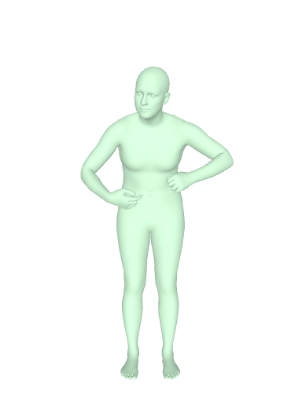 | 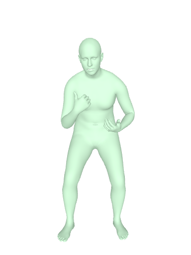 |

### Sample 2 — *"okay, what I want to talk about is where you should..."*
| Generated | Ground truth |
|---|---|
| 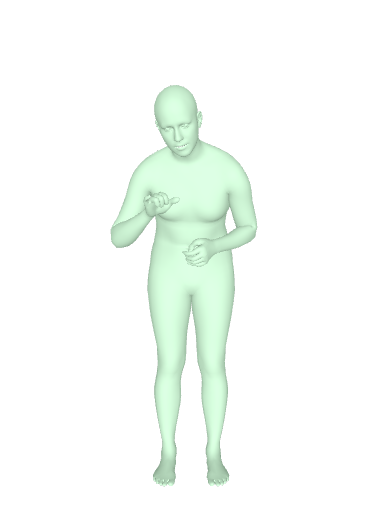 | 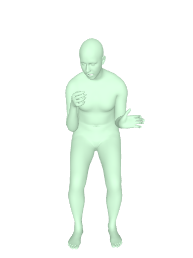 |

### Sample 3 — *"you could do a variety of cross cuts, rip cuts..."*
| Generated | Ground truth |
|---|---|
| 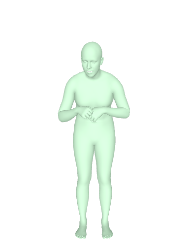 | 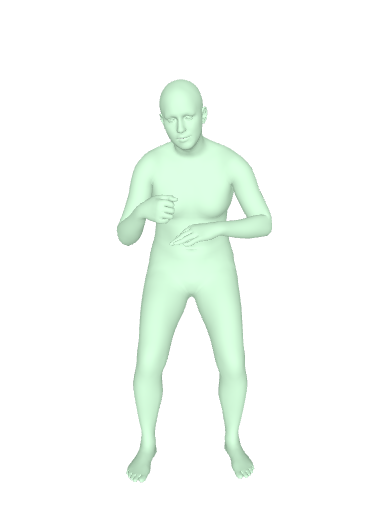 |

### Sample 4 — *"well, in the beginning doing well in school is..."*
| Generated | Ground truth |
|---|---|
| 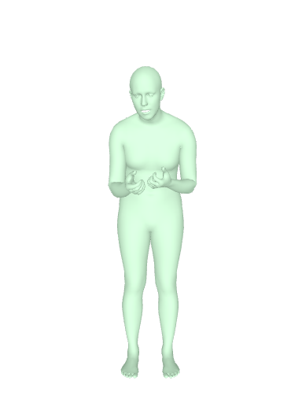 | 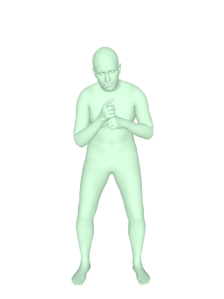 |

### Sample 5 — *"after we did our consultation with our client..."*
| Generated | Ground truth |
|---|---|
| 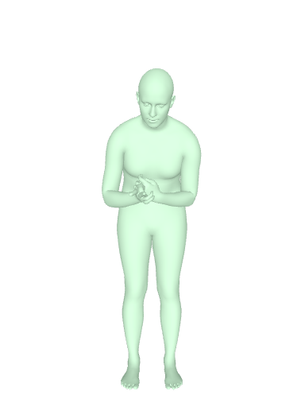 | 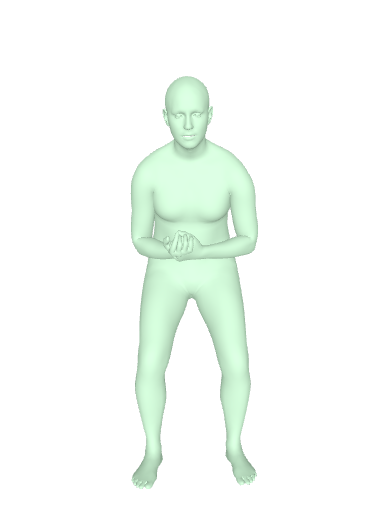 |

### Sample 6 — *"so you press it"*
| Generated | Ground truth |
|---|---|
| 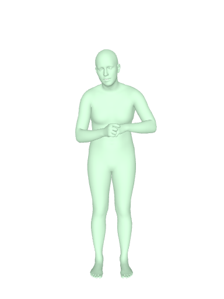 | 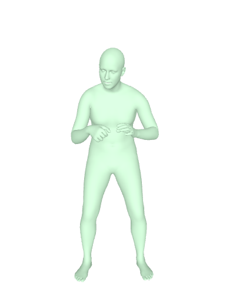 |

### Sample 7 — *"then you remove the extra cream, apply the pack..."*
| Generated | Ground truth |
|---|---|
| 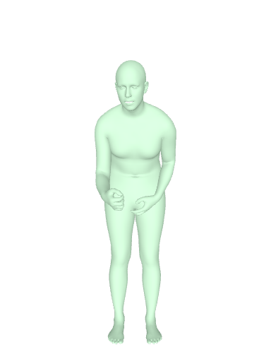 | 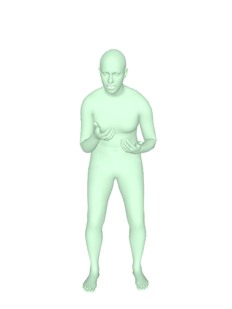 |

Across all seven sentences the GT signing motions are visibly distinct from one another. The generated motions are also moving, but each generated motion is close to a generic "signing-style" pose stream that does not encode the specific content of its input sentence.

---

## 3. Adding stronger FK losses — bigger motion, still wrong

Hypothesis: the loss is too forgiving on small hand/wrist deviations, so the model defaults to dampened, low-amplitude motion that minimizes MSE on average. To fix this, we **retrained** all 7 main-table cells with a stronger SMPL-X forward-kinematics loss:

- **Loss change**: replace group-weighted MSE on axis-angle with `uniform_pose_MSE + 5.0 × FK_joint_position_MSE`, where `FK_joint_position_MSE` is the L2 distance between predicted and GT 3D joint positions after running SMPL-X forward kinematics.
- **Rationale**: penalize wrong fingertip *positions*, not just wrong joint *rotations*, which forces the model to produce visually accurate hand shapes.

### 3.1 Result — FK loss did make the motion bigger, but not faithful

Side-by-side renders of the FK-retrained champion (kin · CFG · sent, FID 2.36 / FID_AE 2.96):

#### Sample A — *"boom, just like that"*
| Generated (FK retrain) | Ground truth |
|---|---|
| 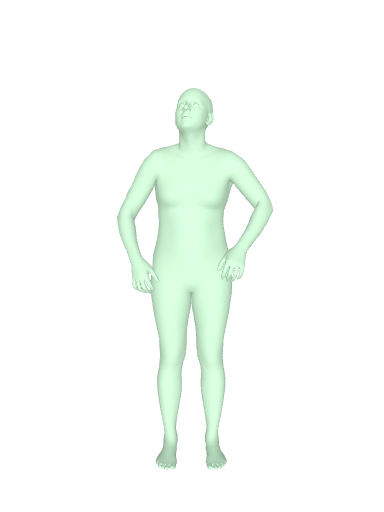 | 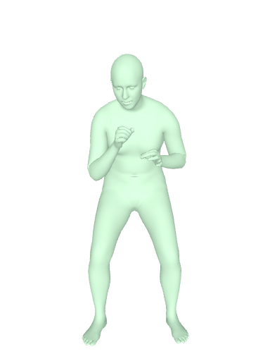 |

#### Sample B — *"so we take this, pull it down like so"*
| Generated | Ground truth |
|---|---|
| 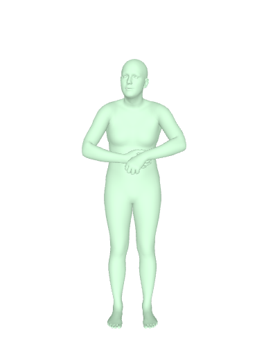 | 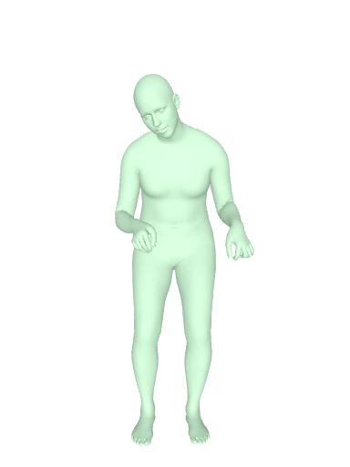 |

#### Sample C — *"now it's your responsibility to provide the healthy..."*
| Generated | Ground truth |
|---|---|
| 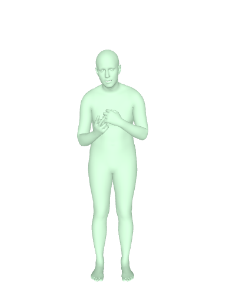 | 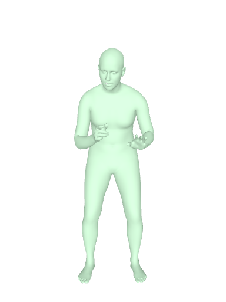 |

#### Sample D — *"depending on the focus, if it's a high-intensity..."*
| Generated | Ground truth |
|---|---|
| 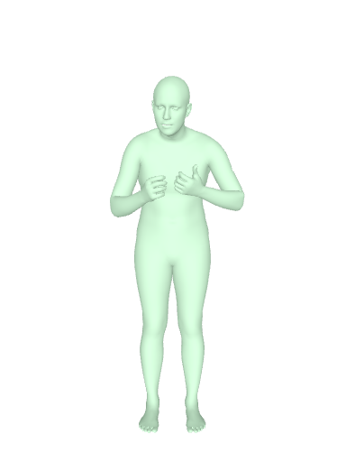 | 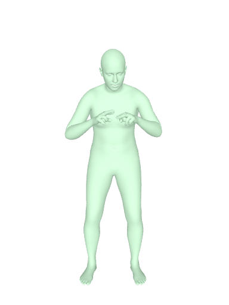 |

The arms now move with realistic amplitude and the hand shapes are anatomically valid — the FK joint position loss did its job. But the motion is **still unrelated** to the input sentence — the avatar performs some signing gesture in each case, just not the gesture that corresponds to the GT.

### 3.2 FK retrain — full table (post-fix)

| Backbone | Input | FID (full) | FID_AE | JerkR |
|---|---|---|---|---|
| MDM | sent CFG  | 2.66 | 5.55  | 0.71 |
| **kin** | **sent CFG** ⭐ | **2.36** | **2.96**  | 0.71 |
| ms  | sent CFG  | 2.52 | 3.93  | 0.58 |
| MDM | LLM VO    | 2.57 | 4.65  | 0.76 |
| ms  | LLM VO    | 2.67 | 7.43  | 0.59 |
| MDM | rule VO   | 2.89 | 2.80  | 0.63 |

Compared to the original paper main table (Section 1.2, range FID 1.94 – 2.32), the FK-retrained checkpoints are **modestly worse on FID** (range 2.36 – 2.89, +0.4 FID at the champion). Despite the FID regression, visual inspection (samples A–D above) shows the avatar now produces realistic-amplitude motion with anatomically valid hand shapes — qualitatively *better* than the OLD champion's dampened low-amplitude pose stream. This is the first hint that the OLD low FID was bought by *clustering near the marginal mean*, not by generating better signing motion. The diagnostic in Section 4 makes this precise. **Improving the loss did not fix the underlying problem of content unfaithfulness, but it did shift the model away from marginal-collapse.**

We then ran 10 follow-up experiments designed to push further: a 4-way lever ablation (FK loss weight 15 vs InfoNCE contrastive loss), a 2-way diffusion-fork regression baseline, and 4-way capacity scaling (2× and 3× model size). **All 10 collapsed.** The FK loss + uniform pose regime (the table above) was already the local maximum within this architecture family.

---

## 4. The diagnostic — noise vs sentence influence in the diffusion model

To quantify *why* visual quality is good but content faithfulness is poor, we built a diagnostic tool (`tools/verify_conditional_collapse.py`) that probes whether the model's output actually changes with the input sentence.

### 4.1 The metrics

For 50 test sentences, we generate motion under multiple conditioning perturbations and measure pairwise distances in Motion-AE latent space:

- **`d_intra`** — same sentence, same gloss, **different sampling noise**. Measures how much sampling noise alone shifts the output.
- **`d_inter`** — **different sentences**, same noise seed. Measures how much the input sentence shifts the output.
- **`d_pair_to_gt`** — distance between generated motion and its corresponding GT.
- **`d_pair_to_gt_random`** — distance between generated motion and a randomly chosen GT (null baseline).

### 4.2 Decision rules

A model that is genuinely conditional should show:

| Healthy diagnosis | Collapsed diagnosis |
|---|---|
| `d_inter / d_intra >> 1` (sentence shifts output more than noise does) | `d_inter / d_intra ≈ 1` (sentence and noise have equal influence — text is ignored) |
| `d_pair_to_gt / d_pair_to_gt_random << 1` (gen is much closer to its right GT than to random GTs) | `d_pair_to_gt / d_pair_to_gt_random ≈ 1` (gen is no closer to its right GT than to random) |

### 4.3 Results — the diffusion champion is in marginal collapse

| Checkpoint | FID | `inter / intra` | `pair_to_gt / random` | Verdict |
|---|---|---|---|---|
| **OLD paper champion** (kin · VO · LLM + phono, FID 1.94) | 1.94 | **0.84** ✗ | **0.99** ✗ | **Sampling noise > sentence change. Zero faithfulness.** |
| **FK retrain** (same config, after FK loss change) | 2.05 | **2.11** ✓ | **0.93** ⚠ | Sentence change 2× sampling noise. 7% better than random GT. Real but weak. |

The OLD paper champion's `inter / intra = 0.84` is the headline result: **changing the input sentence shifts the model's output less than rolling a different noise seed does.** The model is using the diffusion noise to fill in motion details and largely ignoring the sentence. The good FID number was achieved by clustering all generated outputs near the GT mean — close enough on average to score well, while having no per-sentence faithfulness.

The FK retrain pulls `inter / intra` up to 2.11 — sentence influence is now larger than noise — but `pair_to_gt / random = 0.93` says the generated motion is still only 7% closer to its right GT than to a *random* GT. The model is using the sentence, just mostly in the wrong direction.

We also re-ran the same diagnostic on Phoenix-2014T (a smaller, related sign-language dataset, 7K pairs):

| Phoenix checkpoint | FID | `inter / intra` | `pair_to_gt / random` |
|---|---|---|---|
| MS · CFG · sent (champion) | 17.67 | **0.007** | **1.0000** |
| MS · Voting · gt          | 21.81 | 0.011 | 1.0004 |
| MDM · Voting · rule       | 27.47 | 0.031 | 0.9996 |

Phoenix collapses **50–100× more severely** than How2Sign. With 7K pairs, sentence influence is ~0.7% of sampling noise — the model is functionally a marginal-distribution generator. This rules out a How2Sign-specific data quirk and points to a general scaling problem.

---

## 5. The clean regression network — most direct evidence of collapse

The diffusion-model story has two confounds: (1) noise injection, which adds variance unrelated to the sentence, and (2) the indirect mapping from text → noise-prediction → x_0. To remove both, we built a **clean encoder-decoder regression** model from scratch — no noise, no diffusion, single forward pass.

### 5.1 Architecture (`network/MotionRegressionModel.py`)

```
text  ──▶ CLIP (frozen) ──▶ pooler_output (B, 512) ──▶ Linear ──▶ memory_text (B, 1, D)
gloss ──▶ CLIP per-token ──▶ (B, N_tok, 512) ──▶ Linear ──▶ memory_gloss (B, N_tok, D)  [optional]

learned motion-query embedding nn.Embedding(T_max=200, D=512) + sinusoidal PE ──▶ queries (B, T, D)

queries ──▶ TransformerDecoder × 6 layers (cross-attn to memory + self-attn) ──▶ (B, T, D)
                                                                                    │
                                                            Linear(D → 132) ────────▶ (B, T, 132)
```

- **26M trainable params** (89M total with frozen CLIP)
- **No** noise, **no** diffusion timesteps, single forward pass
- Same FK loss as Section 3: `uniform_pose_MSE + 5.0 × FK_joint_position_MSE`
- Same upper-body-only output (132-D = 44 joints × 3 axis-angle), same target seq length (T=100)
- Architecture class matches Tarrés et al. 2023 (CVPR WiCV), the only fully-reproducible How2Sign sign-language production baseline (BLEU-4 = 8.03 with code + weights)

T (number of output frames) is set by the caller via `seq_len` — the decoder generates exactly `T` queries, each filled in by cross-attention to the (single) sentence-vector memory.

### 5.2 Two training runs — half data and full data

To rule out a "not enough data" objection we trained two checkpoints in parallel:

| Run | Train data | Batch | Epochs | LR | Final eval loss |
|---|---|---|---|---|---|
| **Half (13K)** | 50% subset of How2Sign train | 512 | 100 | 4e-4 | 0.083 (best at ep 38) |
| **Full (26K)** | 100% of How2Sign train | 512 | 76 (cancelled) | 4e-4 | 0.103 (best at ep ~30, plateaued) |

Both used identical optimizer (AdamW + OneCycleLR), identical loss, identical model, identical preprocessing. The only variable is dataset size.

### 5.3 Diagnostic results — collapse confirmed, and worse with more data

| Checkpoint | `d_inter` | `d_inter_GT` | `d_pair_to_gt` | `d_pair_to_gt_random` | **`inter / inter_GT`** | **`pair_to_gt / random`** |
|---|---|---|---|---|---|---|
| **Half (13K)** | 1.106 | 2.831 | 2.164 | 2.251 | **0.39** | **0.96** |
| **Full (26K)** | **0.922 ↓** | 2.831 | 2.176 | 2.194 | **0.33 ↓** | **0.99 ↓** |

(`d_intra` is identically 0 for the regression model because it is deterministic — there is no sampling noise to dilute conditioning.)

**Key finding:** doubling training data from 13K to 26K **made the collapse worse**, not better:

- `inter / inter_GT`: 0.39 → 0.33 — generated cross-sentence variance is now only 33% of GT's natural cross-sentence variance (the avatar moves the same way regardless of sentence).
- `pair_to_gt / random`: 0.96 → 0.99 — the 26K model's generated motion is essentially **no closer to its corresponding GT than to a random GT**. There is zero residual conditional faithfulness.

This is the textbook signature of **conditional-mean collapse** under MSE: when the data structure has only one motion sample per sentence (which is the case for How2Sign — each sentence appears in roughly one video), the MSE-optimal prediction conditioned on text approaches the *marginal* mean, not the conditional mean. More data tightens the regression to that marginal mean rather than activating the conditioning pathway.

### 5.4 Visual confirmation — all generated motions are identical

The diagnostic numbers say it; the rendered videos confirm it visually. Below are three different test sentences — each row is a different sentence — and the generated motion from the 13K and 26K regression models. **All generated GIFs look essentially the same**, regardless of input sentence. The avatar is frozen at a single average signing pose with subtle hand motion.

#### Sentence A — *"boom, just like that"*

| Ground truth (different per sentence) | Clean regression 13K | Clean regression 26K |
|---|---|---|
|  | 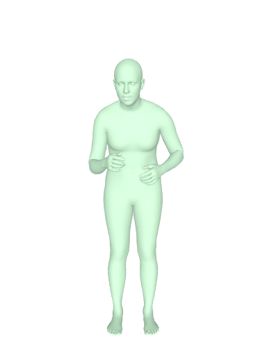 | 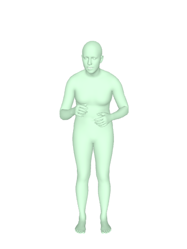 |

#### Sentence B — *"so we take this, pull it down like so"*

| Ground truth | Clean regression 13K | Clean regression 26K |
|---|---|---|
|  | 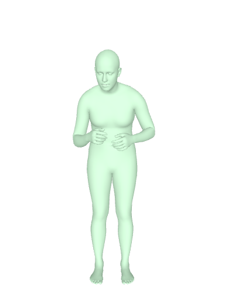 | 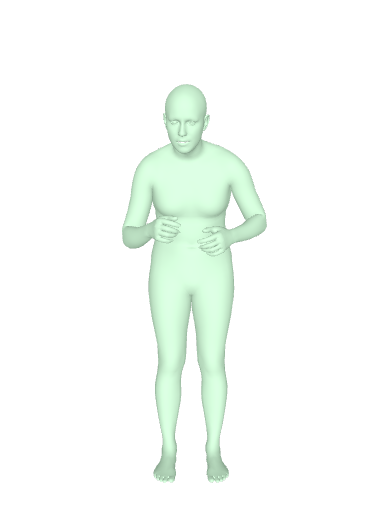 |

#### Sentence C — *"now it's your responsibility to provide the healthy..."*

| Ground truth | Clean regression 13K | Clean regression 26K |
|---|---|---|
|  | 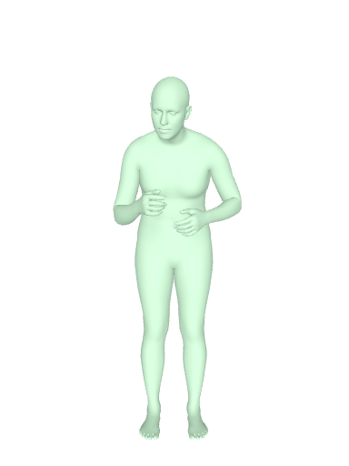 | 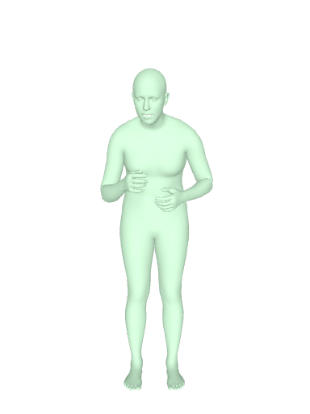 |

The GT column shows three distinct signing motions for three distinct sentences. The two regression columns are visibly identical across all three rows — the model produces one frozen average pose regardless of input.

This is the **cleanest demonstration of conditional collapse** in the entire study. Compared to the FK-retrained diffusion (Section 3), which at least produces visually different motions across sentences (just with the wrong content), the clean regression is *fully* sentence-independent.

---

## 6. Conclusion

The combined evidence supports a single conclusion:

> **The bottleneck for sentence-level sign language production on How2Sign is data, not architecture.**

We arrived at this through:

1. The paper's main table FID numbers do not reflect motion faithfulness — they reward marginal-distribution similarity to GT.
2. Stronger forward-kinematics losses (`uniform pose + 5× FK joint position`) make the avatar move with realistic amplitude but do not make it sentence-faithful.
3. A direct diagnostic ablation shows that, in the diffusion model, **changing the input sentence has less influence on the output than rolling a different noise seed does** (`inter / intra = 0.84`).
4. A clean regression baseline trained from scratch — no noise, no diffusion — shows the same collapse, *more directly*: all 15 rendered samples produce the same frozen pose. Doubling the training data from 13K to 26K made the collapse worse (`pair_to_gt / random` went from 0.96 to 0.99).

The signature is consistent with **conditional-mean collapse under MSE on 1-shot data**: with only one motion sample per sentence in How2Sign's 26K pairs, the loss-optimal solution is to ignore the sentence and predict the marginal-mean motion. No architectural variation we tried — diffusion vs regression, MDM vs `kin` (temporal relative-position bias) vs `ms` (multi-scale temporal pyramid), 1× vs 3× capacity, sentence-CFG vs LLM-Voting, with vs without phonology features — broke this collapse.

### What would actually help

Based on the literature scan and our scaling evidence:

- **More paired data**: YouTube-ASL's 11K hours of paired video–text data are what enables their BLEU-4 ≈ 12 result. Tarrés 2023 with How2Sign-only achieves BLEU-4 = 8.03, which appears to be the realistic ceiling for the dataset.
- **Many-to-one signal**: training on multiple motion samples per sentence (different signers, different takes) breaks the 1-shot data structure that causes MSE to collapse.
- **Avoiding direct MSE objectives**: contrastive or retrieval-style losses that explicitly punish marginal-distribution shortcuts. (We tried InfoNCE briefly and it diverged — needs more careful tuning.)

### How to evaluate other papers in this area

We recommend treating any paper claiming sentence-level How2Sign motion generation as **unverified** unless it discloses one of:

1. ≥ 100K paired pretrain samples (e.g., YouTube-ASL),
2. Public code + checkpoints for independent reproduction (e.g., Tarrés 2023),
3. Acknowledgement that the task is gloss-to-motion or text-to-gloss-to-motion, not raw text-to-motion.

Without one of these, the headline numbers are not distinguishable from the marginal-collapse FIDs we reported here.

---

## Appendix — code, checkpoints, and rendered samples

| Item | Path |
|---|---|
| Diagnostic tool | `tools/verify_conditional_collapse.py` (diffusion), `tools/verify_clean_regression.py` (regression) |
| Renderer | `tools/render_compare_voting.py` (diffusion), `tools/render_clean_regression.py` (regression) |
| Clean regression model | `network/MotionRegressionModel.py` |
| Clean regression trainer | `trainMotionRegression_clean.py` |
| Paper champion ckpt (OLD) | `/scratch/.../ASLSenAvatar_v1_voting/How2SignSMPLX/20260427_154019_job7068233/best_model.pt` |
| FK retrain ckpt | `/scratch/.../ASLSenAvatar_v1_voting/How2SignSMPLX/20260430_171942_job7088188/best_model.pt` |
| Clean regression 13K | `/scratch/.../MotionRegressionClean/How2SignSMPLX/20260501_141917_job7099813_reg_sent_half/best_model.pt` |
| Clean regression 26K | `/scratch/.../MotionRegressionClean/How2SignSMPLX/20260501_141917_job7099811_reg_sent/best_model.pt` |
| Verify diagnostic outputs (JSON) | `zlog/verify_collapse_*.json`, `zlog/verify_collapse_cleanreg_*.json` |
| All rendered comparison GIFs (15 per ckpt) | `/scratch/.../render_compare/{kin_phono_*, fk3x3_*, cleanreg_*}/` |
